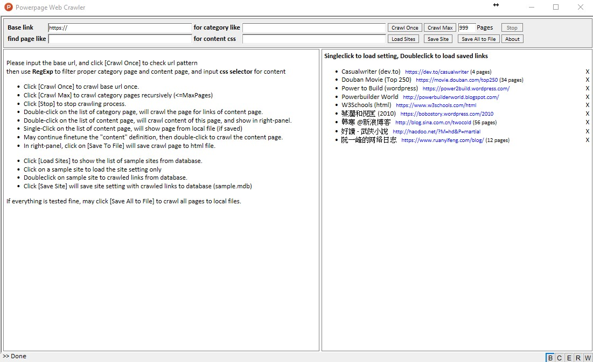
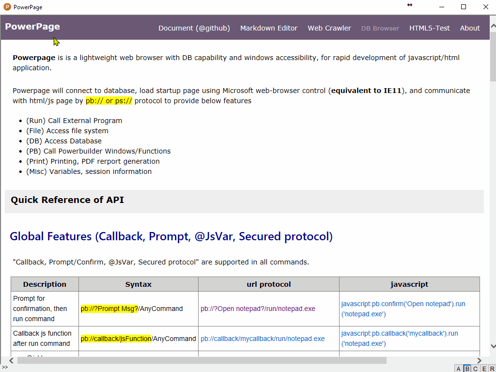

## Document by Markdown

A simple document framework for using markdown as system documentation. 


### Background

Documentation is always a boring job for developer. 
When working on the document of ["Powerpage"](https://github.com/casualwriter/powerpage), 
there are some markdown files composed for github (e.g. README.md).  
I would like to make use of these markdown files for the following purposes

1. Generage document from markdown for **web hosting**. e.g. github page: https://casualwriter.github.io/powerpage/   
2. **Directly run from github repository via CDN**.  e.g. rawgit.org: https://ghcdn.rawgit.org/casualwriter/powerpage/main/source/doc/index.html)   
3. run within [Powerpage](https://github.com/casualwriter/powerpage) with **Powerpage API enabled**.

### How it works

Actually, the program only has **one file** (i.e. [index.html](source/index.html)), in **pure javascript without any dependance**.

it will do the following

1. load markdown file by js function `loadMdFile(file,title)`
2. parse it to html by js function `simpleMarkdown(mdtext)`  
3. show in right-panel with TOC+scrollspy by js function `simpleTOC( srcDIV, toDiv, title )`


### Usage Guide

Please direct modify index.html to link up the top-menu to your markdown files
 
Below is the default setup for [Powerpage Documentation](https://casualwriter.github.io/powerpage/).

```
<body onload="loadMdFile( location.href.split('?file=')[1]||'README.md', '<b>Contents</b>' )">
<div id=header>
  <span id=title>Powerpage <small>(documentation)</small></span>
  <span id=menu style="float:right; padding:12px">
    <button onclick="loadMdFile( 'README.md', this.innerText )">Home</button>
    <button onclick="loadMdFile( 'interface.md', this.innerText )">API</button>
    <button onclick="loadMdFile( 'development.md', this.innerText )">Development</button>
    <button onclick="loadMdFile( 'pp-document.md', this.innerText )">Document.md</button>
    <button onclick="loadMdFile( 'pp-md-editor', this.innerText )" disabled>Markdown-Editor</button>
    <button onclick="loadMdFile( 'pp-web-crawler.md', this.innerText )" disabled>Web-Crawler</button>
    <button onclick="loadMdFile( 'pp-db-report.md', this.innerText )" disabled>DB-Reports</button> 
    <button onclick="window.print()">Print</button> 
    <button style="display:none" onclick="toggleHTML()" accesskey=s>ShowHTML</button> 
  </span>
</div>
<div id=content>
  <div id="left-panel"></div>
  <div id="right-panel"></div>
</div>
</body>
```

Please setup the following items for your documentation site.

* Start Flie  (ie. ``<body onload="loadMdFile( location.href.split('?file=')[1]||'README.md', '<b>Contents</b>' )">`` )
* Page Title  (ie. ``<span id=title>{page-title}</span>``)
* Menu Items  (ie. ``<button onclick="loadMdFile( '{markdown-file}', this.innerText )">{document-title}</button>)``)

then copy [index.html](source/index.html) with markdown documents to web server. that's ALL!

ps: a hidden function for developer. Press [Alt-S] will toggles page between normal and raw HTML.
 

### Simple Markdown

Considered to call js lib for markdown parser. However, some may too heavy, and some do not support IE11.
 
Finally write a simple markdown parser to support [**basic markdown syntax**](#markdown-syntax)

~~~ simple markdown praser
//=== simple markdown parser (updated on 2021/10/20, v0.66, minor fix)
function simpleMarkdown(mdText) {

  // function for REGEXP to convert html tag. ie. <TAG> => &lt;TAG*gt;  
  var formatTag = function (html) { return html.replace(/</g,'&lt;').replace(/\>/g,'&gt;'); }
  
  // function for REGEXP to format code-block, highlight remarks/keywords 
  var formatCode = function(m,p1,p2){
    p2 = p2.replace(/</g,'&lt;').replace(/\>/g,'&gt;').replace(/\/\/(.*)$/gm,'<rem>//$1</rem>')   
    p2 = p2.replace(/(function |return |var |let |const |else |if |for |while |continue |break |case |switch )/gim,'<b>$1</b>')
    return '<pre title="' + p1 + '"><code>'  + p2 + '</code></pre>'
  }

  // function to convert mdString into HTML string  
  var formatMD = function( mdstr ) {
  
      // header => <h1>..<h5> 
      mdstr = mdstr.replace(/^##### (.*?)\s*#*$/gm, '<h5>$1</h5>')
                .replace(/^#### (.*?)\s*#*$/gm, '<h4>$1</h4>')
                .replace(/^### (.*?)\s*#*$/gm, '<h3>$1</h3>')
                .replace(/^## (.*?)\s*#*$/gm, '<h2>$1</h2>')
                .replace(/^# (.*?)\s*#*$/gm, '<h1>$1</h1>')
                .replace(/^<h(\d)\>(.*?)\s*{(.*)}\s*<\/h\d\>$/gm, '<h$1 id="$3">$2</h$1>')
                    
      // horizontal rule => <hr> 
      mdstr = mdstr.replace(/^-{3,}|^\_{3,}|^\*{3,}$/gm, '<hr/>')
      
      // inline code-block: `code-block` => <code>code-block</code>    
      mdstr = mdstr.replace(/``(.*?)``/gm, function(m,p){ return '<code>' + formatTag(p).replace(/`/g,'&#96;') + '</code>'} ) 
      mdstr = mdstr.replace(/`(.*?)`/gm, '<code>$1</code>' )
      
      // blockquote, max 2 levels => <blockquote>{text}</blockquote>
      mdstr = mdstr.replace(/^\>\> (.*$)/gm, '<blockquote><blockquote>$1</blockquote></blockquote>')
      mdstr = mdstr.replace(/^\> (.*$)/gm, '<blockquote>$1</blockquote>')
      mdstr = mdstr.replace(/<\/blockquote\>\n<blockquote\>/g, '\n' )
      mdstr = mdstr.replace(/<\/blockquote\>\n<blockquote\>/g, '\n<br>' )
                
      // image syntax:  =>           
      mdstr = mdstr.replace(/!\[(.*?)\]\((.*?) "(.*?)"\)/gm, '')
      mdstr = mdstr.replace(/!\[(.*?)\]\((.*?)\)/gm, '')
                
      // links syntax: [title](url) => <a href="url" title="title">text</a>          
      mdstr = mdstr.replace(/\[(.*?)\]\((.*?) "new"\)/gm, '<a href="$2" target=_new>$1</a>')
      mdstr = mdstr.replace(/\[(.*?)\]\((.*?) "(.*?)"\)/gm, '<a href="$2" title="$3">$1</a>')
      mdstr = mdstr.replace(/<http(.*?)\>/gm, '<a href="http$1">http$1</a>')
      mdstr = mdstr.replace(/\[(.*?)\]\(\)/gm, '<a href="$1">$1</a>')
      mdstr = mdstr.replace(/\[(.*?)\]\((.*?)\)/gm, '<a href="$2">$1</a>')
                
      // unordered/ordered list, max 2 levels  => <ul><li>..</li></ul>, <ol><li>..</li></ol>
      mdstr = mdstr.replace(/^[\*+-][ .](.*)/gm, '<ul><li>$1</li></ul>' )
      mdstr = mdstr.replace(/^\d[ .](.*)/gm, '<ol><li>$1</li></ol>' )
      mdstr = mdstr.replace(/^\s{2,6}[\*+-][ .](.*)/gm, '<ul><ul><li>$1</li></ul></ul>' )
      mdstr = mdstr.replace(/^\s{2,6}\d[ .](.*)/gm, '<ul><ol><li>$1</li></ol></ul>' )
      mdstr = mdstr.replace(/<\/[ou]l\>\n<[ou]l\>/g, '\n' )
      mdstr = mdstr.replace(/<\/[ou]l\>\n<[ou]l\>/g, '\n' )
                
      // text decoration: bold, italic, underline, strikethrough, highlight                
      mdstr = mdstr.replace(/\*\*\*(\w.*?[^\\])\*\*\*/gm, '<b><em>$1</em></b>')
      mdstr = mdstr.replace(/\*\*(\w.*?[^\\])\*\*/gm, '<b>$1</b>')
      mdstr = mdstr.replace(/\*(\w.*?[^\\])\*/gm, '<em>$1</em>')
      mdstr = mdstr.replace(/___(\w.*?[^\\])___/gm, '<b><em>$1</em></b>')
      mdstr = mdstr.replace(/__(\w.*?[^\\])__/gm, '<u>$1</u>')
      // mdstr = mdstr.replace(/_(\w.*?[^\\])_/gm, '<u>$1</u>')  // NOT support!! 
      mdstr = mdstr.replace(/~~(\w.*?)~~/gm, '<del>$1</del>')
      mdstr = mdstr.replace(/\^\^(\w.*?)\^\^/gm, '<ins>$1</ins>')
      mdstr = mdstr.replace(/\{\{(\w.*?)\}\}/gm, '<mark>$1</mark>')
                
      // table syntax
      mdstr = mdstr.replace(/\n\|([\s\S]*)\|\s*\n\s*\n/g, function (m,p) {
          var thead = p.substr(0, p.indexOf('\n')-1).replace(/\|/g,'<th>')
          var tbody = p.replace(/.*\n\|\-(.*)\-\|\n/g, '').replace(/\|\s*\n/g,'\n<tr>').replace(/\|/g,'<td>')
          return '\n<table><thead>\n<tr><th>' + thead + '</thead>\n<tr>' + tbody + '\n</tr></table>\n\n' 
      } )   
                
      // line break and paragraph => <br/> <p>                
      mdstr = mdstr.replace(/  \n/g, '\n<br/>').replace(/\n\s*\n/g, '\n<p>\n')
      
      // indent as code-block          
      mdstr = mdstr.replace(/^ {4,10}(.*)/gm, function(m,p) { return '<pre><code>' + formatTag(p) + '</code></pre>'} )
      mdstr = mdstr.replace(/^\t(.*)/gm, function(m,p) { return '<pre><code>' + formatTag(p) + '</code></pre>'} )
      mdstr = mdstr.replace(/<\/code\><\/pre\>\n<pre\><code\>/g, '\n' )

      // Escaping Characters                
      return mdstr.replace(/\\([`_~\*\+\-\.\^\\\<\>\(\)\[\]])/gm, '$1' )
  }
   
  // first, handle syntax for code-block
  var pos1=0, pos2=0, mdHTML = ''
  mdText = mdText.replace(/\r\n/g, '\n').replace(/\n~~~/g,'\n```')
  mdText = mdText.replace(/\n``` *(.*?)\n([\s\S]*?)\n``` *\n/g, formatCode )
  
  // split by "<code>", skip for code-block and process normal text
  while ( (pos1 = mdText.indexOf('<code>')) >= 0 ) {
    pos2 = mdText.indexOf('</code>', pos1 )
    mdHTML += formatMD( mdText.substr(0,pos1) ) + mdText.substr(pos1+6, (pos2>0? pos2-pos1-6 : mdtext.length) )
    mdText = mdText.substr( pos2 + 7 )
  }
   
  return mdHTML + formatMD( mdText )
}
~~~

 
  
## Supported Markdown Syntax {markdown-syntax}
 
The simple markdown parser support the [Basic Markdown Syntax](https://www.markdownguide.org/basic-syntax/ "new")  
Some advanced syntax are also supported. Please refer below samples.  

### Heading 

<table border=1><tr><th>Markdown<th>result<th>layout</tr>
<tr><td>
~~~
may add multiple # in right side.  
following with {id} to specify id

# heading 1
## heading 2 {no-toc-1} ##
### heading 3 {no-toc-2} ####
#### heading 4 ########
##### heading 5 {id=five}
~~~
<td><xmp>
# heading 1
## heading 2 {no-toc-1} ##
### heading 3 {no-toc-2} ####
#### heading 4 ########
##### heading 5 {id=five}
</xmp>
<td>
# heading 1   
## heading 2 {no-toc-1} ##
### heading 3 {no-toc-2} ####
#### heading 4 ########
##### heading 5 {id=five}
</td></tr></table>
 
### Text Decoratoin (Bold/Italic)

<table border=1><tr><th>Markdown<th>HTML<th>Rendered Layout</tr>
<tr><td>
~~~
**basic decoration**

this is ***bold+italic*** sample  
this is **bold** sample  
this is *italic* sample  
this is ___bold+italic___ sample  
this is __underline__ sample  
  
**enhance syntax**  
* ~~Strikethrough~~ sample
* ~~delete~~ then ^^insert^^

**disable decoration**
* disable \*\*bold\*\* by esc\  
* disable \*italic\* by esc\  
* disable by following ** with space*  
* not support _italic_ !!
~~~
<td><xmp>
**basic decoration**

this is ***bold+italic*** sample  
this is **bold** sample  
this is *italic* sample  
this is ___bold+italic___ sample  
this is __underline__ sample  
  
**enhance syntax**  
* ~~Strikethrough~~ sample
* ~~delete~~ then ^^insert^^

**disable decoration**
* disable \*\*bold\*\* by esc\  
* disable \*italic\* by esc\  
* disable by following ** with space*  
* not support _italic_ !!
</xmp>
<td>
**basic decoration**

this is ***bold+italic*** sample  
this is **bold** sample  
this is *italic* sample  
this is ___bold+italic___ sample  
this is __underline__ sample  
  
**enhance syntax**  
* ~~Strikethrough~~ sample
* ~~delete~~ then ^^insert^^

**disable decoration**
* disable \*\*bold\*\* by esc\  
* disable \*italic\* by esc\  
* disable by following ** with space*  
* not support _italic_ !!
</td></tr></table>


### Paragraph, Line Breaks and HR

<table border=1><tr><th>Markdown<th>HTML<th>Rendered Layout</tr>
<tr><td>
~~~
Empty will be considered as paragraph.

Don't put tabs or spaces in front of your paragraphs.

Line break will be added     
if line wne with 2+ space  
~~~
<td><xmp>
Empty will be considered as paragraph.

Don't put tabs or spaces in front of your paragraphs.

Line break will be added     
if line wne with 2+ space  
</xmp>
<td>
Empty will be considered as paragraph.

Don't put tabs or spaces in front of your paragraphs.

Line break will be added     
if line wne with 2+ space  
</td></tr><tr><td>
~~~
Use - or _ or * for horizontal rule.

-------- 
________
  
********
~~~
<td><xmp>
Use - or _ or * for horizontal rule.

-------- 
________
  
********
</xmp>
<td>
Use - or _ or * for horizontal rule.

-------- 
________
  
********
</td>
</tr></table>
 
 
### Blockquote and Code-Block

<table border=1><tr><th>Markdown<th>HTML<th>Rendered Layout</tr>
<tr><td>
~~~
> blockquote line1
> blockquote line2
>> blockquote line3
>> blockquote line4
> Below is empty line
>         
> line 5

single quote in same line   
may allow `<b>decoration</b> text` 
  
double quote in same line  
will show ``RAW `<u>text</u>``   
include single quote
~~~
<td><xmp>
> blockquote line1
> blockquote line2
>> blockquote line3
>> blockquote line4
> Below is empty line
>         
> line 5

single quote in same line   
may allow `<b>decoration</b> text` 
  
double quote in same line  
will show ``RAW `<u>text</u>``  
include single quote
</xmp>
<td>
> blockquote line1
> blockquote line2
>> blockquote line3
>> blockquote line4
> Below is empty line
>         
> line 5

single quote in same line   
may allow `<b>decoration</b> text` 
  
double quote in same line  
will show ``RAW `<u>text</u>``   
include single quote
</td></tr></table>

### Lists (Ordered and unordered)

<table border=1><tr><th>Markdown<th>HTML<th>Rendered Layout</tr>
<tr><td>
~~~
use *|+|- for unorder list

* item 1
* item 2
* item 3
~~~
<td><xmp>
use *|+|- for unorder list

* item 1
* item 2
* item 3
</xmp><td>
use *|+|- for unorder list

* item 1
* item 2
* item 3
</td></tr>
<tr><td>
~~~
use number [0-9] with dot for ordered list.

1. one 
1. two
0. three
4. Four
~~~
<td><xmp>
use number [0-9] with dot for ordered list.

1. one 
1. two
0. three
4. Four
</xmp>
<td>
use number [0-9] with dot for ordered list.

1. one 
1. two
0. three
4. Four
</td></tr>
<tr><td>
~~~
indent for nested list, 
max 2 level, level 1 
should be unordered list

* colors
  + red
  + green
  + blue
* numbers
  1. one
  2. two
  
* languages
  0. javascript
  0. python
  0. c, c++
* OS
  - Windows
  - Linux
  - macOS
~~~
<td><xmp>
indent for nested list, 
max 2 level, level 1 
should be unordered list

* colors
  + red
  + green
  + blue
* numbers
  1. one
  2. two
  
* languages
  0. javascript
  0. python
  0. c, c++
* OS
  - Windows
  - Linux
  - macOS
</xmp>
<td>
indent for nested list, 
max 2 level, level 1 
should be unordered list

* colors
  + red
  + green
  + blue
* numbers
  1. one
  2. two
  
* languages
  0. javascript
  0. python
  0. c, c++
* OS
  - Windows
  - Linux
  - macOS
</td></tr>
</table>

 
### Links and Images

<table border=1><tr><th>Markdown<th>HTML</tr>
<tr><td>
~~~
* Link to [google](https://google.com)
* Link with title [youtube](https://youtube.com "google")
* Link in new tab [google](https://google.com "new")
* quick link: <https://youtube.com> 
* direct link: https://youtube.com   
* link as text [https://youtube.com]() 

* Show Image 
  
       
* Show Image with options (width=380px or style="width:70%")

  
       
       
~~~

<td><xmp>
* Link to [google](https://google.com)
* Link with title [youtube](https://youtube.com "google")
* Link in new tab [google](https://google.com "new")
* quick link: <https://youtube.com> 
* direct link: https://youtube.com   
* link as text [https://youtube.com]() 

* Show Image 
  
       
* Show Image with options (width=380px or style="width:70%")

  
       
       
</xmp><td>
</tr></table>

 **Rendered Layout**

* Link to [google](https://google.com)
* Link with title [youtube](https://youtube.com "google")
* Link in new tab [google](https://google.com "new")
* quick link: <https://youtube.com> 
* direct link: https://youtube.com   
* link as text [https://youtube.com]() 

* Show Image 
  
       
* Show Image with options (width=380px or style="width:70%")

  
       
       
  
   
### Escaping Characters


<table border=1><tr><th>Markdown<th>HTML<th>Rendered Layout</tr>
<tr><td>
~~~
\` \~ \_ \* \+ \- \. \^   
\\ \< \> \( \) \[ \]  
~~~
<td><xmp>
\` \~ \_ \* \+ \- \. \^   
\\ \< \> \( \) \[ \]  
</xmp>
<td>
\` \~ \_ \* \+ \- \. \^   
\\ \< \> \( \) \[ \]  
</td>
</tr></table>
 
 
### Tables

below is a typical table 

~~~
| header1 | Header2 | Header3 |
|--------------------------|
| row1,c1 | row1, c2 | row1, c3 |
| r2,col1 | r2,col2 | r2,col3 |
| row3,col1 | row3,col2 | row3,col3 |
~~~

the render output like below

| header1 | Header2 | Header3 |
|--------------------------|
| row1,c1 | row1, c2 | row1, c3 |
| r2,col1 | r2,col2 | r2,col3 |
| row3,col1 | row3,col2 | row3,col3 |


### Enhanced Syntax  {enhanced-syntax}

The following enhanced syntax are support by the simple markdown parser.

however, be aware compatibility issue if document will be parsed by other parser (e.g. github)

* Specify ID for Header. ie. ``\n## header {id} [#*]`` => ``<h2 id={id}>header</h2>``
* Specify title for Code-Block. ie. ``\n~\~\~ {title}\n{code-block}\n~\~\~`` => ``<pre title={title}><code\>{code-block}</code\></pre>``

* link as text. ie. `[link]\()` => ``<a href={link}>{link}</a>``
* text as link for url. ie. ``<https://{url}>`` => ``<a href="https://{url}">https://{url}</a>``   
* Open link in new page. i.e.  ``[text]\(url "new")`` => ``<a href="url" target=_new>text</a>`` 
* Specify title for Link i.e.  ``[text]\(url "title")`` => ``<a href="url" title="title">text</a>``  
* Specify property for image. ie. `![title]\(image "{width=400px,etc..}")`
* table support

* __Underline__ by `_\_Underline_\_` => ``<u>text</u>`  
* ~~Strikethrough~~ by `~\~Strikethrough~\~` => ``<del>text</del>`
* ^^highlight^^ by `^\^highlight^\^` => ``<ins>text</ins>``
* Escaping Characters `` \` \~ \_ \* \+ \- \. \^ \\ &lt; &gt; \( \) \[ \] ``
    
    
        
## To-Do

- [v] some enhance synatx (underline,Strikethrough,highlight)
- [v] some enhance synatx (link as tex, header id, image property)
- [v] enhance code-block
- [v] support table syntax
- [ ] Frontmatter :=  ---\n Name: value \n--- 
- [ ] use Frontmatter for markdown-application 
  

## Modification History

* 2021/10/05, v0.48, initial version
* 2021/10/06, v0.50, html version, and minor revision
* 2021/10/09, v0.60, add scrollspy feature
* 2021/10/11, v0.63, rewrite code-block, highlight remarks and keywords 
* 2021/10/12, v0.64, support table syntax 
* 2021/10/20, v0.66, minor fixes. support nested unordered list. 
* 2021/11/02, v0.67, remove local document, hosted on github-page now. 
